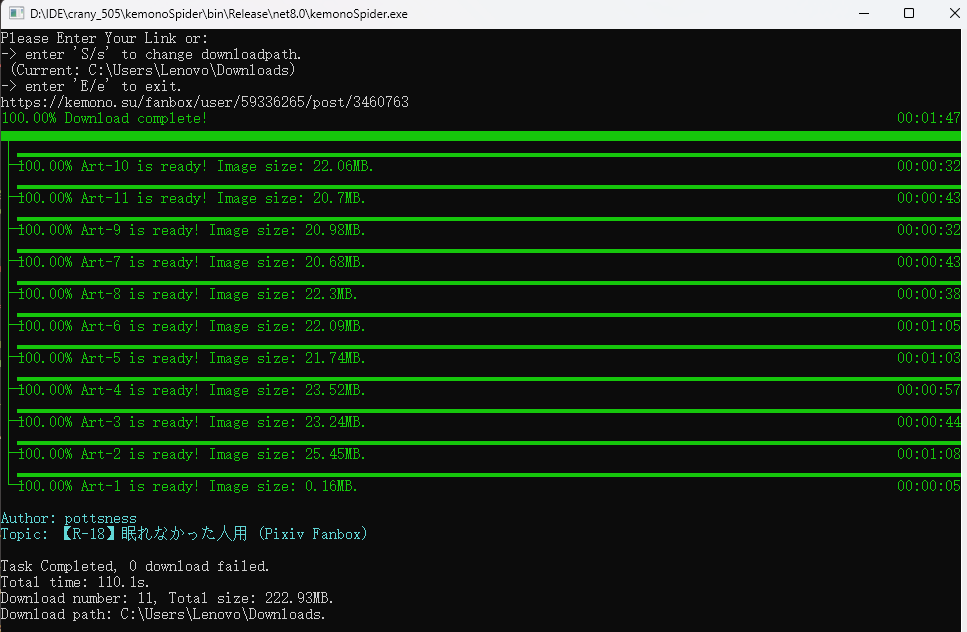
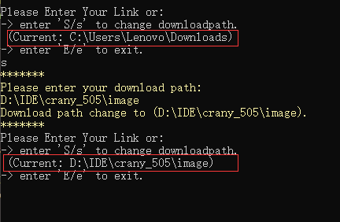
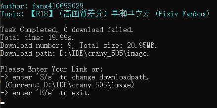
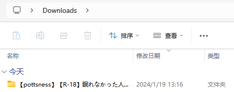
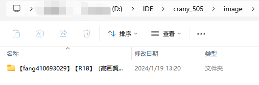

# kemonoSpider
获取kemono网站图片的C#爬虫脚本 

## 开发环境
- Visual Studio Insider-1.86
- .NET -C# 8.0
- .NET FrameWork 4.8

## 实现功能
- 通过链接将该条目下的图片爬取，存储在设置好的本地文件夹，默认路径为系统的`Downloads`文件夹，可自定义，保存的文件名格式为`【作者名】标题名`。
- 控制台下载前显示操作说明和保存路径，下载中显示实时状态进度条，备注成功、retry或失败，下载完成后显示图片有关信息。
- 可自定义保存路径，且记录上一次更改的文件路径。

## 使用方法
输入当前条目下的链接，如"https://kemono.party/fanbox/user/{user_id}/post/{post_id}/" 即可原画质下载全部图片（支持gif，但不支持视频）。 
在输入栏键入S键可修改保存路径，前去复制绝对路径即可。 
输入栏操作可无限进行，直到键入E键退出。

## 实现效果
- **控制台显示**  

- **本地文件显示**  

## 补充
建议使用欧美IP进行下载。
